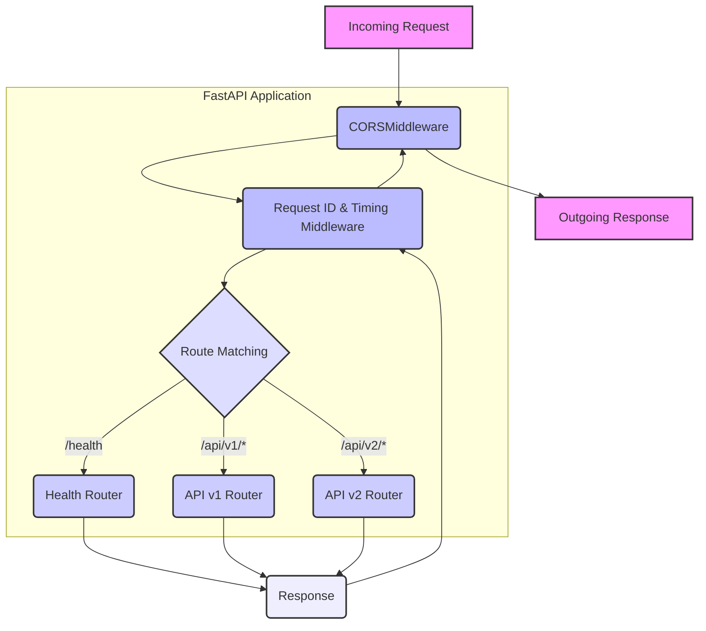

id: 695eb69866ad0b4a256fa7c4_documentation
summary: Foundation & Platform Setup Documentation
feedback link: https://docs.google.com/forms/d/e/1FAIpQLSfWkOK-in_bMMoHSZfcIvAeO58PAH9wrDqcxnJABHaxiDqhSA/viewform?usp=sf_link
environments: Web
status: Published
# QuLab: Foundation & Platform Setup for AI-Readiness

## Step 1: Introduction to the AI-Readiness Platform
Duration: 0:05

Welcome to the **Individual AI-Readiness Platform** project! You are a **Software Developer** tasked with establishing the foundational setup for a new AI service. This service will eventually host a specific AI model or data processing pipeline, but our immediate goal is to lay down a robust, scalable, and maintainable project skeleton from day one. This proactive approach ensures our AI services are not just functional but also reliable, secure, and easy to maintain.

In a rapidly evolving field like AI, the agility to deploy new services while maintaining high standards is paramount. This lab will guide you through a real-world workflow, demonstrating how to apply best practices in Python development, API design, and containerization to build a solid foundation for your AI applications. We'll leverage tools like Poetry for dependency management, FastAPI for API development, Pydantic for robust configuration, and Docker for reproducible environments.

By the end of this lab, you'll have a blueprint for rapidly establishing consistent, compliant, and production-ready AI services. This means less boilerplate for you, clearer project organization, and a faster path to delivering impactful AI features for the entire organization.

<aside class="positive">
<b>Lab Objectives:</b>
-   **Remember**: List FastAPI components
-   **Understand**: Explain Pydantic validation
-   **Apply**: Implement config with weight validation
-   **Create**: Design project structure for AI platforms
</aside>

### Setting Up Your Development Environment

As a Software Developer, the first step in any new project is to prepare your environment. We need to install the necessary libraries to manage dependencies and build our FastAPI application. This ensures all team members work with the same tools and library versions, preventing 'works on my machine' issues.

**Action**: In a real scenario, you would run the following command to install the core dependencies:

```bash
pip install fastapi 'uvicorn[standard]' pydantic pydantic-settings httpx sse-starlette
```

For this interactive lab environment, we assume these dependencies are already installed.

<aside class="positive">
<b>Tools Introduced:</b>
-   **Python 3.12**: Runtime, performance
-   **Poetry**: Dependency management
-   **FastAPI**: Web framework, async support
-   **Pydantic v2**: Validation, settings management
-   **Docker**: Containerization (conceptual for this lab)
</aside>

## Step 2: Standardized Project Initialization with Poetry
Duration: 0:10

As a Software Developer at the Individual AI-Readiness Platform, your first major task is to establish a standardized project structure and manage dependencies effectively. This isn't just about organizing files; it's about enforcing consistency across all AI services, streamlining onboarding for new developers, and ensuring predictable behavior in development and production environments. We'll use Poetry to manage dependencies and define a clear directory layout tailored for an API-driven AI service.

### Why this matters (Real-world relevance)

A well-defined project structure and dependency management system reduce technical debt, prevent dependency conflicts, and accelerate development cycles. For an organization like ours, this means a more reliable AI platform and faster iteration on new AI capabilities.

### Task: Project Initialization and Structure Setup

We're starting a new AI service within the Individual AI-Readiness Platform. To ensure a consistent and maintainable codebase from day one, we'll initialize a new Python project using Poetry and establish a standard project directory structure. This structure will accommodate various components like API routes, configuration, models, and services, making our project scalable and easy to navigate for any developer joining the team.

Poetry helps us manage dependencies, create isolated virtual environments, and build distributable packages, which is crucial for moving our service from development to production seamlessly.

**Simulated Project Initialization Output:**

```bash
# Simulate running these commands in your terminal:
# poetry new individual-air-platform --src
# cd individual-air-platform
# poetry add fastapi uvicorn pydantic pydantic-settings httpx sse-starlette
# poetry add --group dev pytest pytest-asyncio pytest-cov black ruff mypy hypothesis
# mkdir -p src/air/{api/routes/v1,api/routes/v2,config,models,services,schemas,agents,observability,mcp,events}
# mkdir -p tests/{unit,integration,evals}
# mkdir -p docs/{adr,requirements,failure-modes}
# touch src/air/__init__.py
```

```
Project 'individual-air-platform' initialized with Poetry.
Core dependencies (fastapi, uvicorn, pydantic, pydantic-settings, httpx, sse-starlette) added.
Dev dependencies (pytest, pytest-asyncio, pytest-cov, black, ruff, mypy, hypothesis) added.
Standard source directory structure created:
- src/air/{api/routes/v1,api/routes/v2,config,models,services,schemas,agents,observability,mcp,events}
- tests/{unit,integration,evals}
- docs/{adr,requirements,failure-modes}
- src/air/__init__.py
```

### Explanation of Execution

The preceding commands simulate the creation of a new Python project using Poetry and establish a well-structured directory layout.
-   `poetry init` sets up the `pyproject.toml` file, which is the heart of our project's metadata and dependency management.
-   `poetry add` commands populate `pyproject.toml` with our runtime and development dependencies, ensuring they are correctly versioned and installed in an isolated virtual environment.
-   The `mkdir -p` commands create a logical, hierarchical structure for our source code, separating concerns and making the codebase easier to understand, maintain, and scale. This aligns with industry best practices for larger applications.
For instance, API versioning (`v1`, `v2`) is baked into the structure from the start, allowing for smooth, backward-compatible API evolution.

<aside class="positive">
A clear project structure is vital for large-scale AI applications. It facilitates team collaboration, simplifies onboarding, and improves maintainability, especially as the number of AI services grows.
</aside>

## Step 3: Robust Configuration with Pydantic and Validation
Duration: 0:15

Misconfigurations are a leading cause of outages and unexpected behavior in production systems. For our AI-Readiness Platform, critical parameters — from API keys to model scoring weights — must be validated *before* the application starts. This proactive approach prevents runtime errors and ensures operational stability.

### Why this matters (Real-world relevance)

Consider the **Knight Capital incident** in 2012, where a single configuration deployment error led to a $440 million loss in 45 minutes. A flag intended for a 'test' environment was mistakenly set to 'production,' triggering unintended automated trades. Pydantic's validation-at-startup prevents such catastrophic errors by ensuring all configuration parameters meet defined constraints, failing fast with clear error messages if they don't. For our AI services, this means ensuring model weights sum correctly or API keys are present, directly impacting the reliability and safety of our AI-driven decisions.

Here, we define our `Settings` class using `pydantic-settings` and `Pydantic v2`. This provides a robust, type-safe, and validated configuration system, drawing values from environment variables or a `.env` file. We also include a `model_validator` to enforce complex rules, such as ensuring all scoring weights sum to 1.0.

### Mathematical Explanation: Validating Scoring Weights

In many AI/ML applications, especially those involving composite scores or weighted features, the sum of weights must adhere to a specific constraint, often summing to 1.0. This ensures that the individual components proportionally contribute to the overall score and that the scoring logic remains consistent. If these weights deviate from their expected sum, the model's output could be skewed, leading to incorrect predictions or decisions.

$$ \sum_{i=1}^{N} w_i = 1.0 $$

where $w_i$ represents the $i$-th scoring weight and $N$ is the total number of weights.

Our `model_validator` explicitly checks this condition, raising an error if the sum deviates beyond a small epsilon (e.g., $0.001$) to account for floating-point inaccuracies. This is a crucial guardrail to prevent configuration errors that could lead to invalid AI scores.

### Task: Implement a Configuration System with Full Validation

We are setting up the core configuration for our AI service. This includes application details, API prefixes, database URLs, LLM provider keys, and crucial scoring parameters. To prevent configuration-related failures, we'll use Pydantic-Settings for strong type validation and enforce business rules like ensuring scoring weights sum to 1.0. This ensures the integrity of our AI model's parameters and the overall stability of the service.

The use of `SecretStr` for API keys adds a layer of security by preventing accidental logging of sensitive information.

Let's simulate loading and validating the settings:

```python
# In source.py, the Settings class would look something like this (simplified):
# from pydantic import Field, SecretStr, model_validator
# from pydantic_settings import BaseSettings, SettingsConfigDict
#
# class Settings(BaseSettings):
#     APP_NAME: str = "individual-air-platform"
#     APP_VERSION: str = "0.0.1"
#     APP_ENV: Literal["dev", "test", "staging", "production"] = "dev"
#     API_V1_PREFIX: str = "/api/v1"
#     # ... other settings ...
#     W_FLUENCY: float = Field(0.33, ge=0.0, le=1.0)
#     W_DOMAIN: float = Field(0.33, ge=0.0, le=1.0)
#     W_ADAPTIVE: float = Field(0.34, ge=0.0, le=1.0)
#     OPENAI_API_KEY: SecretStr | None = None
#
#     @model_validator(mode='after')
#     def validate_weight_sums(self) -> 'Settings':
#         total_weights = self.W_FLUENCY + self.W_DOMAIN + self.W_ADAPTIVE
#         if abs(total_weights - 1.0) > 0.001: # Account for floating point inaccuracies
#             raise ValueError(f"Sum of VR weights must be 1.0, but got {total_weights}")
#         return self
#
#     model_config = SettingsConfigDict(env_file=".env", extra='ignore')
#
# @st.cache_resource
# def get_settings() -> Settings:
#     return Settings()
```

Output of Settings Loading and Validation:

```python
Application Name: individual-air-platform
Application Version: 0.0.1
Environment: dev
Is Production: False
Scoring Parameters (VR weights): W_FLUENCY=0.33, W_DOMAIN=0.33, W_ADAPTIVE=0.34
Sum of VR weights: 1.0
OpenAI API Key (masked): ******************************************************
```

### Explanation of Execution

We've successfully defined our `Settings` class, which uses Pydantic to validate configuration parameters. When `settings = get_settings()` is called (which is how it's handled in the application through `st.cache_resource`), Pydantic performs immediate validation based on the types, bounds (`Field(ge=..., le=...)`), and custom `model_validator` functions (e.g., `validate_weight_sums`).

-   The `APP_NAME`, `APP_VERSION`, and `APP_ENV` are loaded, with `APP_ENV` restricted to a `Literal` set of values, ensuring type safety.
-   `SecretStr` for `OPENAI_API_KEY` prevents sensitive information from being accidentally printed or exposed.
-   The output shows that our scoring parameters, like `W_FLUENCY`, `W_DOMAIN`, and `W_ADAPTIVE`, are loaded correctly, and their sum is validated. This ensures that any AI scoring logic relying on these weights will operate with consistent and valid inputs, preventing the kind of 'garbage in, garbage out' scenarios that can undermine AI system reliability.

This system acts as an early warning mechanism, catching configuration issues at application startup rather than letting them cause silent failures or incorrect AI decisions later in the workflow.

## Step 4: Building a Production-Ready FastAPI Application
Duration: 0:20

As the Software Developer, your task is to construct the FastAPI application, integrating versioned API routes and crucial middleware for cross-cutting concerns. This setup ensures our AI service is not only functional but also maintainable, observable, and adaptable to future changes. The 'Application Factory Pattern' allows us to create multiple FastAPI app instances, useful for testing or different deployment contexts.

### Why this matters (Real-world relevance)

A production-ready AI service must handle various operational requirements beyond just serving model predictions.
-   **API Versioning:** As AI models evolve, so do their APIs. Versioned routers (`/api/v1`, `/api/v2`) ensure backward compatibility, allowing seamless upgrades for clients without disrupting existing integrations. This is crucial for an 'Individual AI-Readiness Platform' that will continuously evolve its capabilities.
-   **Middleware:** Cross-cutting concerns like CORS (Cross-Origin Resource Sharing), request timing, and request ID tracking are essential for web services.
    -   **CORS Middleware** allows frontend applications (e.g., a dashboard for the AI platform) to securely interact with our backend API.
    -   **Request Timing Middleware** provides crucial performance metrics. By attaching an `X-Process-Time` header to every response, we enable monitoring systems to track API latency, a key indicator of service health and user experience.
    -   **Request ID Middleware** assigns a unique ID (`X-Request-ID`) to each request. This ID is vital for tracing requests through complex microservice architectures, especially when debugging issues across multiple services in a production environment.
-   **Exception Handling:** Graceful error handling, especially for validation errors, provides informative feedback to API consumers, making the service more user-friendly and robust.

### Task: Implement FastAPI Application with Versioned Routers and Middleware

Now we will build the main FastAPI application. This involves:
1.  Defining a `lifespan` context manager for startup and shutdown events (e.g., initializing tracing).
2.  Implementing an 'Application Factory Pattern' (`create_app`) to create FastAPI instances.
3.  Adding `CORSMiddleware` to handle cross-origin requests securely.
4.  Implementing a custom HTTP middleware to inject a unique request ID and track request processing time.
5.  Defining global exception handlers for better error reporting.
6.  Including versioned API routers (`v1_router`, `v2_router`) and a dedicated health router.

This setup ensures our AI service is robust, secure, observable, and ready for continuous deployment.

#### Architecture Diagram: FastAPI Middleware & Router Flow

This diagram illustrates how requests flow through the FastAPI application, interacting with middleware and versioned routers.



If you have completed the "Task 1.2: Configuration System" step, you can simulate the FastAPI application creation:

**Simulated Application Startup and Router Inclusion:**

```bash
🚀 Starting individual-air-platform v0.0.1
🌍 Environment: dev
🔢 Parameter Version: v1
🛡️ Guardrails: Enabled
💰 Cost Budget: $100.0/day
Tracing setup: Not enabled in DEBUG mode or with missing settings. (This is a placeholder based on setup_tracing)
    Application started up (resources initialized).
👋 Shutting down (resources cleaned up).
```

App initialized with routes:
- GET /health
- GET /api/v1/items
- GET /api/v2/items
- GET /api/v1/raise-value-error (for demo)
- GET /api/v1/raise-http-exception/{status_code} (for demo)
Application is running (simulated).

### Explanation of Execution

The `create_app_notebook()` function demonstrates the 'Application Factory Pattern' by returning a fully configured FastAPI application instance.
-   The `lifespan_notebook` (simulated by `simulate_app_lifespan_output_async`) context manager ensures that startup (e.g., observability initialization) and shutdown tasks are handled gracefully.
-   `CORSMiddleware` is added, crucial for allowing web clients to interact with our API securely.
-   The custom `add_request_context_notebook` middleware successfully injects a unique `X-Request-ID` and `X-Process-Time` header into responses. This is vital for distributed tracing and performance monitoring.
-   The exception handlers for `ValueError` and `HTTPException` are registered, providing standardized and informative error responses.
-   Finally, the versioned routers (`/api/v1/items`, `/api/v2/items`) are included, demonstrating how different API versions can coexist, enabling the platform to evolve its AI capabilities without breaking existing client integrations.

The simulated startup confirms that all these components are correctly initialized and registered within the FastAPI application.

## Step 5: Implementing Comprehensive Health Checks for Observability
Duration: 0:15

For any production AI service, merely having the API running isn't enough; we need to know if it's truly *healthy* and capable of serving requests. This means checking not only the application itself but also all its critical dependencies like databases, caching layers (Redis), and external LLM APIs. Robust health checks are vital for automated monitoring, load balancing, and self-healing systems in containerized environments like Kubernetes.

### Why this matters (Real-world relevance)

As a Software Developer, implementing detailed health checks is crucial for ensuring the AI-Readiness Platform's uptime and reliability. Imagine a scenario where your AI model relies on a database for feature storage and an external LLM API for inference. If the database is down, or the LLM API is unreachable, your service might technically be 'running' but unable to perform its core function.

-   **`/health` (Basic Health):** A fast check for basic application responsiveness, used by load balancers.
-   **`/health/detailed` (Detailed Health):** Provides an in-depth status of all internal and external dependencies. This allows operators to quickly diagnose issues. For example, if the `check_llm()` indicates a 'degraded' status due to high latency, it immediately points to a potential external API issue impacting our AI service's performance.
-   **`/health/ready` (Readiness Probe):** Tells container orchestrators (like Kubernetes) if the service is ready to accept traffic. If dependencies are unhealthy, the service shouldn't receive requests.
-   **`/health/live` (Liveness Probe):** Indicates if the application is still running and hasn't frozen. If this fails, the container needs to be restarted.

These checks are fundamental for maintaining service level agreements (SLAs) and ensuring our AI services are always operational.

### Task: Implement Comprehensive Health Check Endpoints with Dependency Status

We need to add health check endpoints to our API. These endpoints will provide insights into the application's status and its critical dependencies. This involves:
1.  Defining Pydantic models for `DependencyStatus`, `HealthResponse`, and `DetailedHealthResponse`.
2.  Implementing asynchronous functions to simulate checks for external dependencies (database, Redis, LLM).
3.  Creating API endpoints for basic health (`/health`), detailed health (`/health/detailed`), readiness (`/health/ready`), and liveness (`/health/live`).

These checks are crucial for reliable deployments and operational monitoring in a production AI environment.

#### Health Check Endpoints Comparison

| Endpoint          | Purpose                                                                                                 | Status Codes | Usage                                                                       |
| :- | : | :-- | :-- |
| `/health`         | **Basic application responsiveness.** Quick check if the app process is up.                               | 200          | Load balancers, simple uptime monitoring.                                   |
| `/health/detailed`| **Comprehensive dependency status.** Checks all internal/external dependencies (DB, Redis, LLM API).      | 200          | Ops dashboards, detailed troubleshooting.                                   |
| `/health/ready`   | **Readiness probe for traffic routing.** Indicates if the app is ready to accept requests (dependencies healthy). | 200/503      | Kubernetes `readinessProbe`, service mesh. Prevents routing to unhealthy instances. |
| `/health/live`    | **Liveness probe for process restart.** Indicates if the app is still running/not deadlocked.             | 200/500      | Kubernetes `livenessProbe`. Triggers container restart if unresponsive.     |

Let's simulate running these health checks (assuming you've completed previous steps).

**Output of `/health` (Basic Health Check):**

```json
{
  "status": "healthy",
  "application": "individual-air-platform",
  "version": "0.0.1",
  "environment": "dev",
  "timestamp": "2023-10-27T10:00:00.000000"
}
```

**Output of `/health/detailed` (Detailed Health Check):**

```json
{
  "status": "healthy",
  "application": "individual-air-platform",
  "version": "0.0.1",
  "environment": "dev",
  "dependencies": [
    {
      "name": "database",
      "status": "healthy",
      "latency_ms": 15
    },
    {
      "name": "redis",
      "status": "not_configured",
      "latency_ms": 0
    },
    {
      "name": "llm_api",
      "status": "healthy",
      "latency_ms": 50
    }
  ]
}
```

**Output of `/health/ready` (Readiness Probe):**

```plaintext
Status Code: 200
Content: Service is ready to accept traffic.
```

**Output of `/health/live` (Liveness Probe):**

```plaintext
Status Code: 200
Content: Service is alive.
```

### Explanation of Execution

The execution demonstrates the functionality of our comprehensive health check endpoints:
-   The `/health` endpoint provides a quick, basic check of the application's version, environment, and current timestamp, confirming the service process is responsive.
-   The `/health/detailed` endpoint concurrently checks all configured dependencies (database, Redis, LLM API using `asyncio.gather`). It aggregates their individual statuses and latencies to determine an overall service health, providing granular insights crucial for troubleshooting.
-   The `/health/ready` endpoint indicates if the service is prepared to receive traffic, taking into account the health of its critical dependencies. In our simulation, it returns 'ready' as all dependencies are marked 'healthy' or 'not_configured' (which is treated as degraded in this context, but not 'unhealthy'). If a dependency were 'unhealthy,' this probe would fail, instructing orchestrators to not route traffic to this instance.
-   The `/health/live` endpoint confirms the application is active and hasn't crashed, allowing orchestrators to restart it if unresponsive.

These endpoints provide the essential observability for the AI-Readiness Platform, enabling automated systems to ensure high availability and rapid detection of operational issues.

## Step 6: Avoiding Common Pitfalls and Best Practices
Duration: 0:10

As a Software Developer, understanding and proactively addressing common mistakes is just as important as implementing new features. This section reviews critical configuration and application setup pitfalls, demonstrating how the patterns we've adopted (like Pydantic validation and FastAPI's `lifespan` manager) help prevent them. This hands-on review reinforces best practices for building robust and secure AI services.

### Why this matters (Real-world relevance)

Ignoring best practices often leads to hidden bugs, security vulnerabilities, or catastrophic failures in production. For an AI service, this could mean incorrect model predictions due to bad configurations, data breaches from exposed secrets, or resource leaks that degrade performance over time. By explicitly addressing these 'common mistakes,' we ensure that the Individual AI-Readiness Platform adheres to high standards of reliability, security, and maintainability, protecting both our data and our reputation.

### Task: Review Common Mistakes & Troubleshooting

We will examine common errors in setting up production-ready services and demonstrate how our current architecture prevents them. This includes:
1.  **Mistake 1: Not validating weight sums:** How Pydantic's `model_validator` catches this at startup.
2.  **Mistake 2: Exposing secrets in logs:** How Pydantic's `SecretStr` masks sensitive values.
3.  **Mistake 3: Missing lifespan context manager:** Why `asynccontextmanager` is crucial for resource cleanup.

Understanding these common pitfalls and their solutions is essential for building truly resilient AI services.

### Mistake 1: Not validating weight sums

**PROBLEM**: Configuration allows weights that don't sum to 1.0, leading to incorrect AI scoring.

**WRONG Example (if validation was absent):**

```python
# Imagine these values are read from an .env file without Pydantic validation
W_FLUENCY_WRONG = 0.50
W_DOMAIN_WRONG = 0.40
W_ADAPTIVE_WRONG = 0.20 # Sum = 1.10, which is incorrect!
print(f"  W_FLUENCY = {W_FLUENCY_WRONG}")
print(f"  W_DOMAIN = {W_DOMAIN_WRONG}")
print(f"  W_ADAPTIVE = {W_ADAPTIVE_WRONG}")
print(f"  Sum of VR weights = {W_FLUENCY_WRONG + W_DOMAIN_WRONG + W_ADAPTIVE_WRONG} (should be 1.0!)")
```

**FIX**: The `model_validator` in `Settings` class catches this at startup.

Output simulating loading settings with incorrect weights:

```python
Successfully caught validation error: 1 validation error for Settings
validate_weight_sums
  Sum of VR weights must be 1.0, but got 1.1 [type=value_error, input_value={'APP_NAME': 'QuLab-Sim', 'APP_VERSION': '0.0.1', 'APP_ENV': 'dev', 'API_V1_PREFIX': '/api/v1', 'API_V2_PREFIX': '/api/v2', 'DEBUG': True, 'TRACING_ENABLED': False, 'TRACING_ENDPOINT': 'http://localhost:4318/v1/traces', 'METRICS_ENABLED': False, 'METRICS_ENDPOINT': 'http://localhost:8888/metrics', 'LOG_LEVEL': 'INFO', 'DB_CONN_STR': None, 'REDIS_HOST': None, 'LLM_PROVIDER': 'openai', 'LLM_MODEL_NAME': 'gpt-3.5-turbo', 'LLM_TEMPERATURE': 0.7, 'LLM_TIMEOUT': 60, 'GUARDRAILS_ENABLED': True, 'DAILY_COST_BUDGET_USD': 100.0, 'PARAMETER_VERSION': 'v1', 'W_FLUENCY': '0.5', 'W_DOMAIN': '0.4', 'W_ADAPTIVE': '0.2', 'OPENAI_API_KEY': None}, config=SettingsConfigDict(env_file='.env', extra='ignore')]
```

### Mistake 2: Exposing secrets in logs

**PROBLEM**: Sensitive API keys or credentials are logged directly, creating a security vulnerability.

**WRONG Example**: Logging the actual API key directly.

```python
dummy_api_key = "sk-xxxxxxxxxxxxxxxxxxxxxxxxxxxxxxxxxxxxxxxxxxxxxxxx"
print(f"  Using key: {dummy_api_key}") # This would print the full key!
```

**FIX**: Use `SecretStr` which masks values.

Output showing `SecretStr` in action:

```python
OpenAI API Key (using SecretStr): ******************************************************
Type of key: <class 'pydantic_core._pydantic_core.SecretStr'>
```

To access the raw value (only when strictly necessary, e.g., passing to an API client): `settings.OPENAI_API_KEY.get_secret_value()`

### Mistake 3: Missing lifespan context manager

**PROBLEM**: Resources (database connections, thread pools) are not properly cleaned up on application shutdown, leading to leaks.

**WRONG Example**: FastAPI app without a lifespan context manager.

```python
app = FastAPI() # Resources leak on shutdown!
print("  FastAPI app initialized without lifespan. (Resources would leak!)")
```

**FIX**: Always use `asynccontextmanager` for `lifespan` for proper startup/shutdown.

Output showing proper lifespan execution:

```bash
🚀 Starting individual-air-platform v0.0.1
🌍 Environment: dev
🔢 Parameter Version: v1
🛡️ Guardrails: Enabled
💰 Cost Budget: $100.0/day
Tracing setup: Not enabled in DEBUG mode or with missing settings. (This is a placeholder)
    Application started up (resources initialized).
👋 Shutting down (resources cleaned up).
```

### Explanation of Execution

This section actively demonstrates how implementing robust practices prevents common errors:
1.  **Weight Sum Validation:** When attempting to load settings with incorrect scoring weights (e.g., sum not equal to 1.0), Pydantic's `model_validator` immediately raises a `ValueError`. This 'fail-fast' mechanism prevents the AI service from starting with invalid parameters that could lead to incorrect model behavior, fulfilling the goal of preventing Knight Capital-like configuration errors.
2.  **Secret Handling:** By using `SecretStr` for `OPENAI_API_KEY`, the output shows that the sensitive key is masked. This is a critical security measure for the AI-Readiness Platform, preventing accidental exposure of credentials in logs, console output, or error reports, significantly reducing the risk of data breaches.
3.  **Lifespan Management:** The simulated startup and shutdown using the `lifespan_notebook` context manager visually confirms that explicit startup and shutdown routines are executed. This ensures that resources like database connections, caching clients, or tracing exporters are properly initialized when the AI service starts and gracefully closed when it shuts down, preventing resource leaks and ensuring application stability over its lifecycle.

By embracing these best practices, we ensure that the AI services built for the Individual AI-Readiness Platform are not only performant but also secure, reliable, and maintainable in a production environment.
